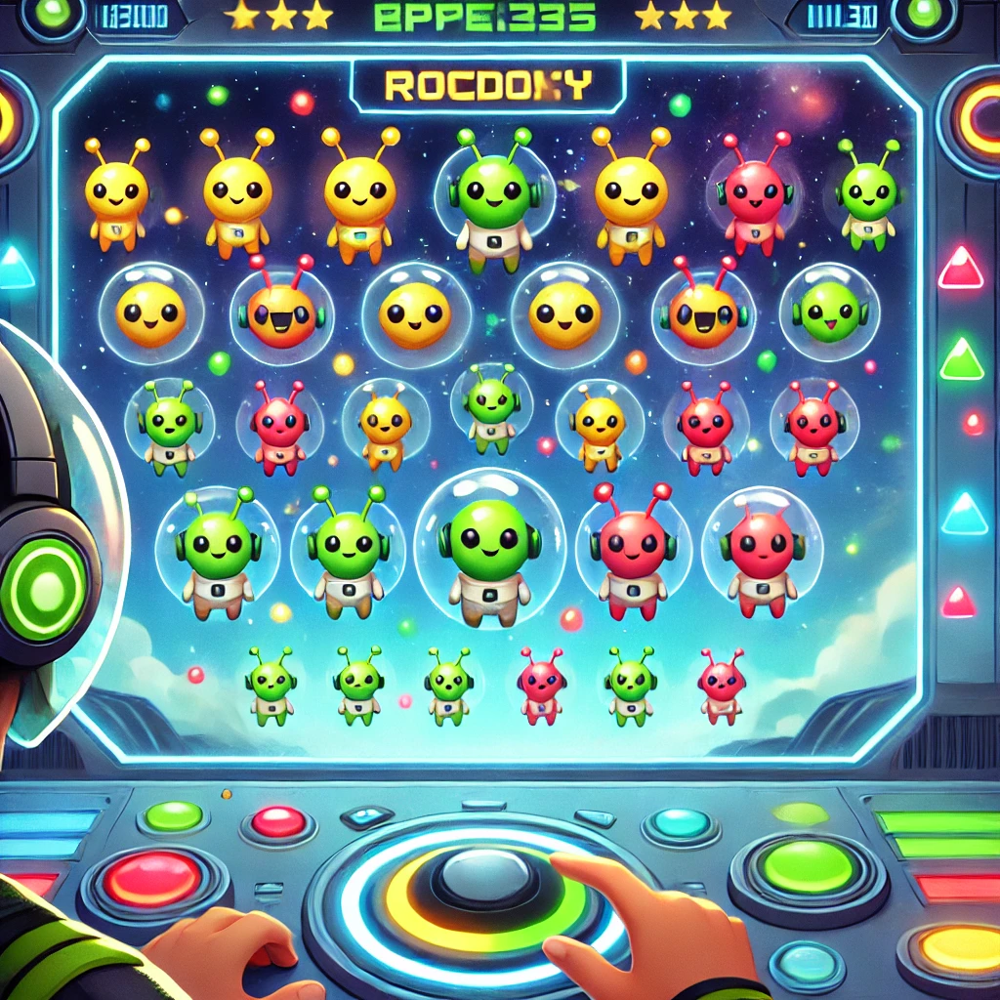

# Retos

[UNO](./SolucionRetos/UNO.py)

- Crea un comentario en el código y coloca la URL del sitio web oficial del lenguaje de programación Python.
- Representa las diferentes sintaxis que existen de crear comentarios en el lenguaje.
- Crea una variable (y una constante si el lenguaje lo soporta).
- Crea variables representando todos los tipos de datos primitivos.
- Imprime por terminal el texto: "¡Hola, [y el nombre de uno de tus compañeros]!"

[DOS](./SolucionRetos/DOS.py)

- Ingresa al siguiente link: [Ascii Art](https://www.asciiart.eu/) y escoge alguno de los ejemplos que te agrade para que realices un programa que imprima tu ascci art.

[TRES](./SolucionRetos/TRES.py)

- Escribir un programa que muestre por pantalla el resultado de la siguiente operación aritmética: $(\frac{3+2}{2*5})^2$ 

- Escribir un programa que pida al usuario dos números enteros y muestre por pantalla el enunciado: <n> entre <m> da un cociente <c> y un residuo <r>. 
Donde <n> y <m> son los números introducidos por el usuario, y <c> y <r> son el cociente y el residuo de la división entera respectivamente. 

[CUATRO](./SolucionRetos/CUATRO.py)

[CINCO](./SolucionRetos/CINCO.py)

- Escribir un programa que pida al usuario una palabra y la muestre por pantalla 10 veces.

- Escribir un programa que almacene la cadena de caracteres contraseña en una variable, pregunte al usuario por la contraseña hasta que introduzca la contraseña correcta.

- Escribir un programa que pida al usuario un número entero y muestre por pantalla si es un número primo o no.

- Escribir un programa que muestre por pantalla la tabla de multiplicar del 1 al 10.

- Escribe un programa que muestre por consola (con un print) los números de 1 a 100 (ambos incluidos y con un salto de línea entre cada impresión), sustituyendo los siguientes:
    - Múltiplos de 3 por la palabra "fizz".
    - Múltiplos de 5 por la palabra "buzz".
    - Múltiplos de 3 y de 5 a la vez por la palabra "fizzbuzz".

[SEIS](./SolucionRetos/SEIS.py)

- Escribir un programa que pregunte el nombre completo del usuario en la consola y después muestre por pantalla el nombre completo del usuario tres veces, una con todas las letras minúsculas, otra con todas las letras mayúsculas y otra solo con la primera letra del nombre y de los apellidos en mayúscula. El usuario puede introducir su nombre combinando mayúsculas y minúsculas como quiera.

- Escribir un programa que pregunte el nombre del usuario en la consola y después de que el usuario lo introduzca muestre por pantalla `<NOMBRE>` tiene `<n>` letras, donde `<NOMBRE>` es el nombre de usuario en mayúsculas y `<n>` es el número de letras que tienen el nombre.

- Escribir un programa que pida al usuario que introduzca una frase en la consola y muestre por pantalla la frase invertida.

- Escribir un programa que almacene las asignaturas de un curso (por ejemplo Matemáticas, Física, Química, Historia y Lengua) en una lista, pregunte al usuario la nota que ha sacado en cada asignatura, y después las muestre por pantalla con el mensaje En `<asignatura>` has sacado `<nota>` donde `<asignatura>` es cada una des las asignaturas de la lista y `<nota>` cada una de las correspondientes notas introducidas por el usuario.